# Summary

In this study, our goal is to build a predictive model to answer the [House Prices Kaggle Competition](https://www.kaggle.com/c/house-prices-advanced-regression-techniques/overview), in which we are provided with diverse data concerning houses such as quality, number of bathrooms, areas, in order to predict the final sale price.

The data provided being very diverse, the large majority of this study will be spent on exploratory data analysis and feature engineering. Following that, some time will be spend on model building and especially on tuning hyperparameters.


# Loading packages

Throughout this project, we will use the following packages:


```r
library(ggplot2)
library(ggrepel)
library(Ckmeans.1d.dp) 
library(dplyr)
library(data.table)
library(corrplot)
library(caret)
library(randomForest)
library(gbm)
library(gridExtra)
library(scales)
library(psych)
library(xgboost)
library(e1071)
library(glmnet)
```

# Loading the data

As a personal habit, I automate the downloading and loading processes. The original data can be found on [this Kaggle page](https://www.kaggle.com/c/house-prices-advanced-regression-techniques/overview)


```r
# This will create a "data" folder in the current directory and store the data in it

if (!file.exists("data")){
   dir.create("data")
}

trainurl <- "https://storage.googleapis.com/kagglesdsdata/competitions/5407/868283/train.csv?GoogleAccessId=web-data@kaggle-161607.iam.gserviceaccount.com&Expires=1600334118&Signature=m8A295cdrmCFr1Qo8tweV0krSrzo%2Flis%2B51piiEOmc%2BKUYKQzUshHC2uG00JWzt03KkMDFiz0FpHO95VLzEQFddzD%2B%2Byi43nEGe0XfEXYP7wAKUrEPGTDY0kRtf3Y7n50JDmhp0WGnxzVK47FH1xbuJFacvWhnpAwO78fhVQH6x0HiNsfz8U2rYtkHefSaBy08Dnztggx%2BWEd0Q9vEA4mtqRuT%2Btd4%2FNra2n0BDdZUZ4BDQGaxdXU6aSDoP9XYMv6vbB4%2FFH13YCxbnUr3JuS85g%2FTxM%2Ba5pkmGq1rnijPXHqwRA9WKK%2BFSVhuZ%2Fv3N65u9vUCsnY2kAox26vnd3HQ%3D%3D&response-content-disposition=attachment%3B+filename%3Dtrain.csv"

trainfile <- "./data/train.csv"

testurl <- "https://storage.googleapis.com/kagglesdsdata/competitions/5407/868283/test.csv?GoogleAccessId=web-data@kaggle-161607.iam.gserviceaccount.com&Expires=1600334123&Signature=RgHIdDwVbnPVzd34JSDORiVnsqzsL%2B7OCr%2BQHKjNprCjj58ipSaQLwDKWo73vDLK9hEcRN6kqYMn3%2FVvnO9zX5HY5H%2FCXz6TUoq9iPkA8qLpwPqIv32O96aHb9of6%2BKX%2FLbw1r%2FQKiZOc%2FmIVe13zB7qGcjZaREDJH9v2dBbAIh4SBrc09vgMEzvJS5XqBcw3HuQHmPDfCsboYMFLTH%2F7uV5PPuVvB%2Fr%2BvsDZsR46OOz1gdTKdS1qYcjfa2w%2FJNYpKJ2uAeSAjpulyAKSSyf3FxJQS0EF%2BqqWRrtWE8X%2FIEAZlRKosWHIdLy%2FENyjX0d3Ltpylkd9neTPebQXjj6Yw%3D%3D&response-content-disposition=attachment%3B+filename%3Dtest.csv"

testfile <- "./data/test.csv"

if (!file.exists(trainfile)){
   download.file(trainurl, trainfile, method = "curl")
}

if (!file.exists(testfile)){
   download.file(testurl, testfile, method = "curl")
}

test <- read.csv(testfile)
train <- read.csv(trainfile)
```

# Exploratory data analysis

It's now time to take a look at our data. The first thing we'll do is to convert both train and test sets to data tables to make future modifications easier. 


```r
train <- data.table(train)
test <- data.table(test)
```


## Dimensions

Let's have a look at the dimensions of our training set :


```r
dim(train)
```

```
## [1] 1460   81
```

We have a set that has a lot of variables, 81 in total, but is overall quite small, with only 1460 observations.
Let's have a look at the variables we have here :


```r
names(train)
```

```
##  [1] "Id"            "MSSubClass"    "MSZoning"      "LotFrontage"  
##  [5] "LotArea"       "Street"        "Alley"         "LotShape"     
##  [9] "LandContour"   "Utilities"     "LotConfig"     "LandSlope"    
## [13] "Neighborhood"  "Condition1"    "Condition2"    "BldgType"     
## [17] "HouseStyle"    "OverallQual"   "OverallCond"   "YearBuilt"    
## [21] "YearRemodAdd"  "RoofStyle"     "RoofMatl"      "Exterior1st"  
## [25] "Exterior2nd"   "MasVnrType"    "MasVnrArea"    "ExterQual"    
## [29] "ExterCond"     "Foundation"    "BsmtQual"      "BsmtCond"     
## [33] "BsmtExposure"  "BsmtFinType1"  "BsmtFinSF1"    "BsmtFinType2" 
## [37] "BsmtFinSF2"    "BsmtUnfSF"     "TotalBsmtSF"   "Heating"      
## [41] "HeatingQC"     "CentralAir"    "Electrical"    "X1stFlrSF"    
## [45] "X2ndFlrSF"     "LowQualFinSF"  "GrLivArea"     "BsmtFullBath" 
## [49] "BsmtHalfBath"  "FullBath"      "HalfBath"      "BedroomAbvGr" 
## [53] "KitchenAbvGr"  "KitchenQual"   "TotRmsAbvGrd"  "Functional"   
## [57] "Fireplaces"    "FireplaceQu"   "GarageType"    "GarageYrBlt"  
## [61] "GarageFinish"  "GarageCars"    "GarageArea"    "GarageQual"   
## [65] "GarageCond"    "PavedDrive"    "WoodDeckSF"    "OpenPorchSF"  
## [69] "EnclosedPorch" "X3SsnPorch"    "ScreenPorch"   "PoolArea"     
## [73] "PoolQC"        "Fence"         "MiscFeature"   "MiscVal"      
## [77] "MoSold"        "YrSold"        "SaleType"      "SaleCondition"
## [81] "SalePrice"
```

## Exploring the response variable

Our response variable here that we want to predict is *SalePrice*. The first exploratory data analysis we want here is to have a look at its distribution :


```r
ggplot(data = train, aes(x = SalePrice)) + geom_histogram(fill="blue")
```

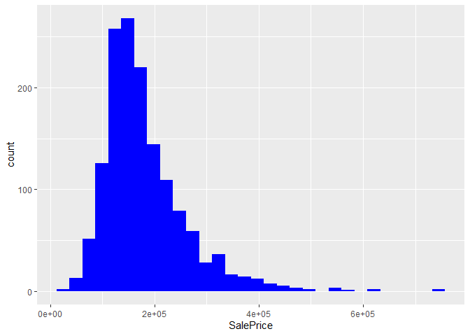<!-- -->
Here, we can see that *SalePrice* has a skewed distribution. We can highlight that even more with a density plot (in blue) compared to a normal distribution (in red) :


```r
ggplot(data = train, aes(x = SalePrice)) + geom_density(fill="blue") + 
   stat_function(fun = dnorm, 
                 args = list(mean = mean(train$SalePrice), sd = sd(train$SalePrice)), 
                 colour = "red")
```

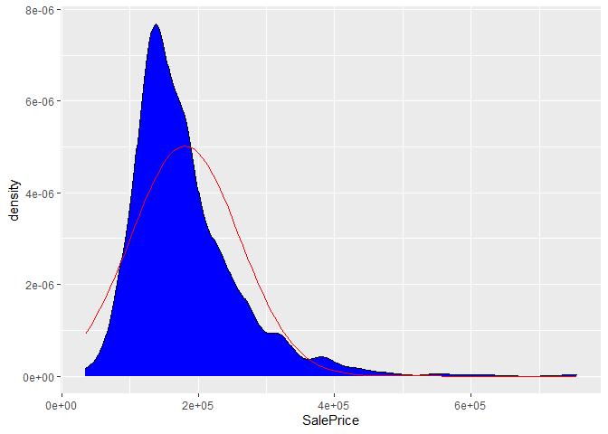<!-- -->

Generally, models will tend to predict normally distributed data. Therefore, our response being skewed means that any model we build will have a higher than normal inaccuracy unless we apply a transformation to make the data gaussian, such as predicting logs or a Box-Cox transformation. We will get to that during the pre-processing phase.


## Variables' class

Let's have a look at the variables' class :

```r
train[, lapply(.SD, class), .SDcols = names(train[,1:14])]
```

```
##         Id MSSubClass  MSZoning LotFrontage LotArea    Street     Alley
## 1: integer    integer character     integer integer character character
##     LotShape LandContour Utilities LotConfig LandSlope Neighborhood Condition1
## 1: character   character character character character    character  character
```
We have a lot of character variables; the [data description file provided by kaggle](https://www.kaggle.com/c/house-prices-advanced-regression-techniques/data) indicates that these are classification variables with only a few possible values. They should therefore be converted to factors.


```r
to_factor <- names(which(sapply(train, class) == "character"))
```

Similarly, while some of the integer or numeric vectors indicate a truly numeric value, such as *LotArea* which indicates the lot size in square feet, others are - again - classification variables, such as *MSSubClass*, which identifies the type of dwelling involved in the sale, with, for instance, 20 signifying "1-STORY 1946 & NEWER ALL STYLES" (see data description file). 
We have 3 such variables : *MSSubClass*, *OverallQual*, and *OverallCond*.

These will also have to be converted to factor. However, for now it suits us to keep them as numeric, so we'll convert them later on


## Dates

We have 4 variables that contain date information :

- YearBuilt: Original construction date
- YearRemodAdd: Remodel date (same as construction date if no remodeling or additions)
- GarageYrBlt: Year garage was built
- YrSold: Year Sold

Intuitively, it can be said that these variables, especially the construction date, can have an impact on the final price, which seems to be confirmed in this plot :


```r
qplot(train$YearBuilt, train$SalePrice) + labs(x = "Construction Date",
                                               y = "House Sale Price") +
   ggtitle("House sale price by year of construction")
```

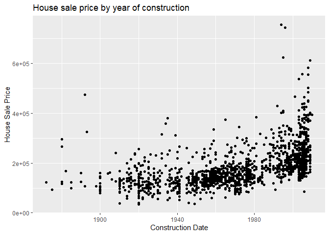<!-- -->

Looking at the range of dates and their linear relationship with the sale price, we'll keep the dates variables as integer. 

However, the *GarageYrBlt* variable is problematic since it is set to NA when there is no garage, and can cause trouble when we preprocess missing values (we'll get to NAs in general in a minute). 

Therefore, we'll either remove this variable if it contributes little to the data set or convert it to factor with a "none" level if it does.

We'll check if this variable is highly correlated to others. Let's see the correlation percentage between *YearBuilt* and *GarageYrBlt* :


```r
cor(train$YearBuilt, train$GarageYrBlt, use = "complete")
```

```
## [1] 0.8256675
```
Therefore, we can say that this variable contributes little to the dataset, and we can safely remove it.

## Missing values (NAs) 

Before we convert these variables to factor and go forward into the analysis, we need to first have a look at the proportion of NAs in the dataset.

Let's first see which columns have NAs :


```r
temp_na <- as.numeric(train[, lapply(.SD, function(y){sum(is.na(y))})])
names(temp_na) <- names(train)
temp_na <- temp_na[temp_na > 0]
print(temp_na)
```

```
##  LotFrontage        Alley   MasVnrType   MasVnrArea     BsmtQual     BsmtCond 
##          259         1369            8            8           37           37 
## BsmtExposure BsmtFinType1 BsmtFinType2   Electrical  FireplaceQu   GarageType 
##           38           37           38            1          690           81 
##  GarageYrBlt GarageFinish   GarageQual   GarageCond       PoolQC        Fence 
##           81           81           81           81         1453         1179 
##  MiscFeature 
##         1406
```

We have 6965 NAs, which is around 6% of our data. However, the description file indicates that for some variables, NA doesn't mean a missing value but an absence of feature. For instance, for the *Alley* column, NA signifiest that there is no alley access.

Therefore, in some cases, NAs contain valuable information, and since we might do some pre-processing to convert missing values later on and we don't want to change this type of NA, we'll change them to a "None" level for factor variables.

The factor variables concerned by this are *Alley*, *BsmtQual*, *BsmtCond*, *BsmtExposure*, *BsmtFinType1*, *BsmtFinType2*, *FireplaceQu*, *GarageType*, *GarageFinish*, *GarageQual*, *GarageCond*, *PoolQC*, *Fence*, and *MiscFeature*. As seen previously, we ignore *GarageYrBlt* since we will remove this variable


```r
# Factor variables for which NA means "none" are mostly those with more that 10NAs,
# except LotFrontage. We remove GarageYrBlt, thus the -c(1, 10)
temp_na2 <- temp_na[temp_na> 10][-c(1,10)]

print(temp_na2)
```

```
##        Alley     BsmtQual     BsmtCond BsmtExposure BsmtFinType1 BsmtFinType2 
##         1369           37           37           38           37           38 
##  FireplaceQu   GarageType GarageFinish   GarageQual   GarageCond       PoolQC 
##          690           81           81           81           81         1453 
##        Fence  MiscFeature 
##         1179         1406
```

## Data cleaning

We will now take all that have been said so far to clean the data. We will also remove the first column since it is the ID variable for the various houses in our dataset.


```r
# Step 1 : convert NAs 
for (j in names(temp_na2)){
   set(train,which(is.na(train[[j]])),j,"None")
}

# Step 2 :  convert to factor

train[, (to_factor) := lapply(.SD, as.factor), .SDcols = to_factor]

# step 3 : Delete ID and GarageYrBuilt variables
train <- train[, -c(1,60)]
```

## Correlation

Of our 79 remaining variables, 36 are numeric :


```r
sum(sapply(train, function(y){class(y) == "integer"}))
```

```
## [1] 36
```

Now, we want to see a correlation plot. This will allow us to see which variables are the most correlated to *SalePrice*, and also which ones are highly correlated between each other. Ideally, we want to maximise the number of numeric variables we can use, which explains why we didn't convert some of them to factor yet.


```r
integer_cols <- sapply(train, function(y){class(y) == "integer"})
integer_train <- train[, .SD, .SDcols = integer_cols]


# Correlation matrix :
train_cor <- cor(integer_train, use = "complete")

# Isolate SalePrice column and sort variables from highest cor with SalePrice
# to lowest cor
train_cor_sort <- as.matrix(sort(train_cor[,'SalePrice'], decreasing = TRUE))

# Keep cors > 0.5
high_cors <- names(which(apply(train_cor_sort, 1, function(x) abs(x)>0.5)))
train_cor <- train_cor[high_cors, high_cors]

# Corrplot2 is a modified version of corrplot that prevents labels to go out of
# the image's frame. If you're interested, it will be on my .Rmd file
corrplot2(train_cor, method = "square", type = "lower", 
         title = "Correlation plot between numeric variables",
         tl.col = "black", tl.cex = 0.6, 
         mar = c(0,0,2,0))
```

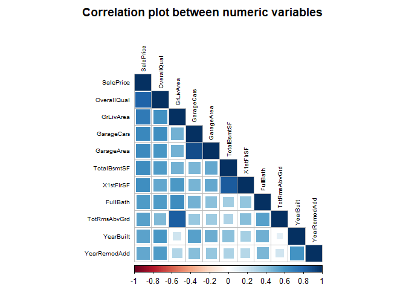<!-- -->

Now that the corrplot is made, we can convert the "false numeric" variables to factor :


```r
to_factor <- c(to_factor,"MSSubClass", "OverallQual", "OverallCond")
train[, (to_factor) := lapply(.SD, as.factor), .SDcols = to_factor]
```

### Correlation with response variable 

The three variables with the highest correlation with *SalePrice* are *OverallQual*, *GrLivArea* and *TotalBsmtSF*.

Let's have a look at their relationship :

#### Overall Quality


```r
ggplot(data = train, aes(x = OverallQual, y = SalePrice)) + geom_boxplot()+
   geom_text_repel(
      aes(label = ifelse((train$OverallQual == 10 & train$SalePrice < 300000), 
                         rownames(train), '')
          ))
```

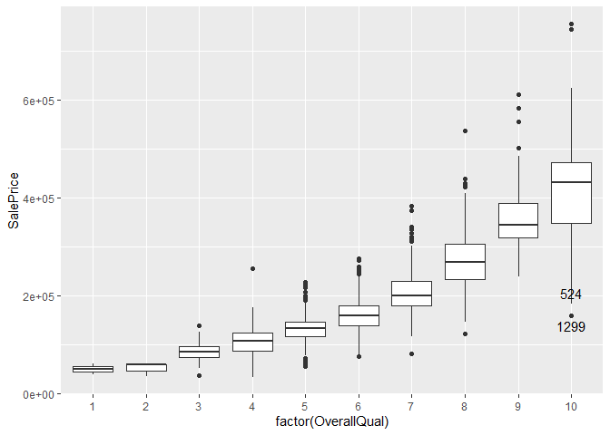<!-- -->

#### Above grade (ground) living area square feet


```r
qplot(GrLivArea, SalePrice, data = train) + geom_smooth(method = "lm", se = F)+
   geom_text_repel(
      aes(label = ifelse((train$GrLivArea > 4500 | train$SalePrice > 550000), 
                         rownames(train), '')
          ))
```

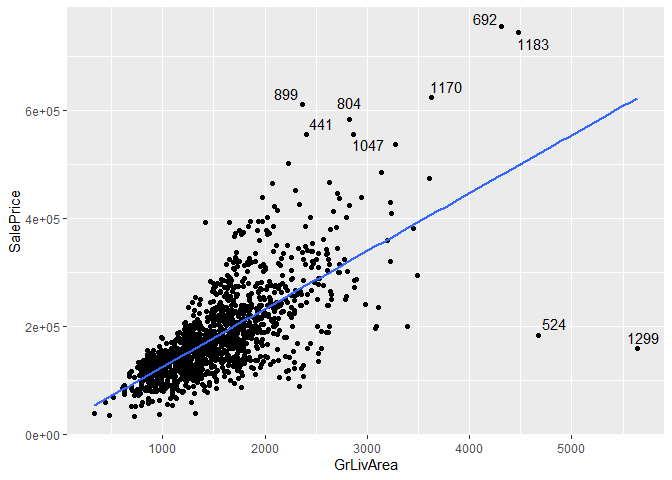<!-- -->

#### Total square feet of basement area


```r
qplot(TotalBsmtSF, SalePrice, data = train) + geom_smooth(method = "lm", se = F)+
   geom_text_repel(
      aes(label = ifelse((train$TotalBsmtSF > 3000 | train$SalePrice > 550000), 
                         rownames(train), '')
          ))
```

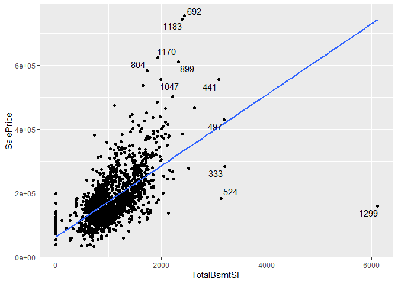<!-- -->


#### First inferences

From only these 3 most important numeric variables, we can see that there are outliers that have either abnormally high prices or abnormally low prices. The row number of these outliers are displayed on the plots.

Therefore, we might want to remove them from the training set and, overall, build models that are robust to outliers, which means that random forests should not be adapted to our case study.

### Correlation between predictors

We find that there are some variables that have strong correlations with each other :

- GarageCars and GarageArea
- 1stFlrSF (First Floor square feet) and TotalBsmtSF (Total square feet of basement area)
- TotRmsAbvGrd (Total rooms above grade) and GrLivArea (Above grade living area square feet)

Below are their correlation coefficients :


```r
cor(train$GarageCars, train$GarageArea)
```

```
## [1] 0.8824754
```

```r
cor(train$X1stFlrSF, train$TotalBsmtSF)
```

```
## [1] 0.81953
```

```r
cor(train$TotRmsAbvGrd, train$GrLivArea)
```

```
## [1] 0.8254894
```

Moreover, GarageCars, GrLivArea and TotalBsmtSF are heavily correlated to other variables. We would therefore tend to remove them from the dataset. However, they are also heavily related to the response variable ; we might risk losing accuracy if we remove them. 

Therefore, we will need to do some feature engineering at some point to combine redundant variables that are highly correlated to each other.


# Back to NAs : imputing values

We previously took a look at our dataset's missing values and focused on those that meant "none" rather that actual NAs.

Now, we will work on the latter and see how we can input values to them :


```r
temp_na <- as.numeric(train[, lapply(.SD, function(y){sum(is.na(y))})])
names(temp_na) <- names(train)
temp_na <- temp_na[temp_na > 0]
print(temp_na)
```

```
## LotFrontage  MasVnrType  MasVnrArea  Electrical 
##         259           8           8           1
```

Except for *LotFrontage*, most variables have a low number of NAs, which are located in the following observations :


```r
which(is.na(train$MasVnrType))
```

```
## [1]  235  530  651  937  974  978 1244 1279
```

```r
which(is.na(train$MasVnrArea))
```

```
## [1]  235  530  651  937  974  978 1244 1279
```

```r
which(is.na(train$Electrical))
```

```
## [1] 1380
```
By removing 5 rows, we can make it so that we only have to focus on the *LotFrontage* variable, so that's what we'll do :


```r
row_remove <- unique(c(which(is.na(train$MasVnrType)), 
                       which(is.na(train$MasVnrArea)),
                       which(is.na(train$Electrical))))
train <- train[-row_remove, ]
```

## LotFrontage 

The *LotFrontage* variable refers to the linear feet of street connected to a property. 

For each missing value, we'll input the mean of the *LotFrontage* value for the associated neighborhood. This means we assume that, for every neighborhood, the *LotFrontage* values are rather condensed around a mean value. 

Actually, this can be confirmed by looking at this plot :


```r
ggplot(data = train, aes(x = Neighborhood, y = LotFrontage)) + geom_boxplot() + 
   theme(axis.text.x = element_text(angle = 45, vjust = 1, hjust = 1))
```

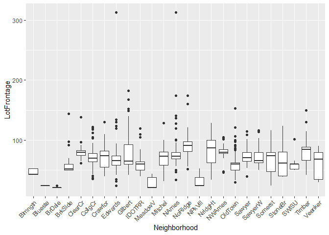<!-- -->

We'll create a data table with contains, for each neighborhood, the mean of its *LotFrontage*, and set the *Neighborhood* values as keys to call the associated mean value when needed :


```r
neig_lf_mean <- train %>% group_by(Neighborhood) %>% 
   summarize(meanLF = mean(LotFrontage, na.rm = T)) %>%
   mutate(meanLF = round(meanLF))

neig_lf_mean <- data.table(neig_lf_mean)

setkey(neig_lf_mean, Neighborhood)
```

Now, for each missing value of *LotFrontage*, we extract the associated *Neighborhood* value, call its *LotFrontage* mean thanks to our new data table, and input it to our train set :


```r
for (i in 1:nrow(train)){
   if (is.na(train$LotFrontage[i])){
      ngbr <- train$Neighborhood[i]
      lf_mean <- neig_lf_mean[.(ngbr)]$meanLF # calling the mean with the key
      train$LotFrontage[i] <- lf_mean
   }
}
```

## Checking NAs 

Now, we should have no remaining missing value in our set :


```r
temp_na <- as.numeric(train[, lapply(.SD, function(y){sum(is.na(y))})])
names(temp_na) <- names(train)
temp_na <- temp_na[temp_na > 0]
print(temp_na)
```

```
## named numeric(0)
```

# Variable importance

Correlation plots are a quick and efficient way to check the most important variables but can only be applied to numeric variables. To get a true indication of which variables are the most important, we have to take into account the categorical variables, and the easiest way to do that is to use the *importance* variable of a random forest model fit. 

We previously said that random forest models would be a poor fit for this study, but that is only because it is not the best one to use when we have outliers. other than that, we can still trust the results such a model would give us concerning variable importance.

Now we have to keep in mind here that we only want to have an indication of variable importance, so we will not do any pre-processing like we would do during our actual model building :


```r
set.seed(1234)
modfit_rf <- randomForest(SalePrice ~ ., data = train, 
                          ntree = 200, 
                          importance = T)
imp_rf <- importance(modfit_rf)
imp_rf <- data.table(variables = row.names(imp_rf), inc_mse = imp_rf[, 1])
imp_rf <- arrange(imp_rf, desc(inc_mse))

ggplot(data = filter(imp_rf, inc_mse >= 5), 
       aes(x = reorder(variables, -inc_mse), y = inc_mse, fill = inc_mse)) + 
   geom_bar(stat = "identity") +
   theme(axis.text.x = element_text(angle = 45, vjust = 1, hjust = 1),
         legend.position = "none")+
   labs(x = "Variables", 
        y = "% increase in MSE if variable is shuffled")
```

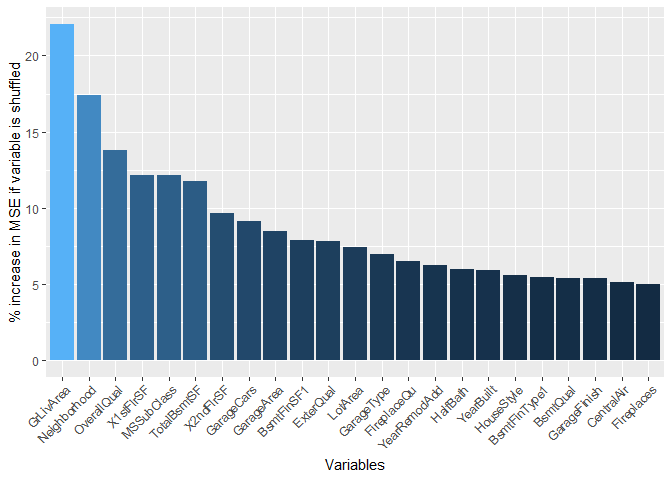<!-- -->

Among the most important variables, we have a mix of categorical and numeric variables, which means that we have to use a model that properly uses large amounts of categorical data.


# Feature engineering

## Area Variables

Our dataset contains several variables that deal with areas which have some redundancies :


```r
head(select(train, X1stFlrSF, X2ndFlrSF, LowQualFinSF, GrLivArea, BsmtFinSF1, BsmtFinSF2, BsmtUnfSF, TotalBsmtSF))
```

```
##    X1stFlrSF X2ndFlrSF LowQualFinSF GrLivArea BsmtFinSF1 BsmtFinSF2 BsmtUnfSF
## 1:       856       854            0      1710        706          0       150
## 2:      1262         0            0      1262        978          0       284
## 3:       920       866            0      1786        486          0       434
## 4:       961       756            0      1717        216          0       540
## 5:      1145      1053            0      2198        655          0       490
## 6:       796       566            0      1362        732          0        64
##    TotalBsmtSF
## 1:         856
## 2:        1262
## 3:         920
## 4:         756
## 5:        1145
## 6:         796
```
*GrLivArea* seems to be the sum of *X1stFlrSF*, *X2ndFlrSF*, and *LowQualFinSF*. Similarly, *TotalBsmtSF* seems to be the sum of *BsmtFinSF1*, *BsmtFinSF2*, and *BsmtUnfSF*. Let's verify it :


```r
with(train, cor((X1stFlrSF + X2ndFlrSF + LowQualFinSF), GrLivArea))
```

```
## [1] 1
```

```r
with(train, cor((BsmtFinSF1 + BsmtFinSF2 + BsmtUnfSF), TotalBsmtSF))
```

```
## [1] 1
```
The correlation is exactly 1, which means our assumption was correct. What we'll do here is that we will combine *GrLivArea* and *TotalBsmtSF* into a single *TotalSF* variable and delete the rest :


```r
train[, TotalSF := GrLivArea + TotalBsmtSF]
train <- select(train, -c("X1stFlrSF", "X2ndFlrSF", "LowQualFinSF", "GrLivArea", 
                "BsmtFinSF1", "BsmtFinSF2", "BsmtUnfSF", "TotalBsmtSF"))
```

## Bathroom variables 

Our dataset also contains several bathroom variables that will be combined into and replaced by a single variable. Variables labeled as "HalfBath" will be counted for half :


```r
train[, TotalBath := FullBath + (0.5 * HalfBath) + BsmtFullBath + (0.5 * BsmtHalfBath)]
train <- select(train, -c("FullBath", "HalfBath", "BsmtFullBath",  "BsmtHalfBath"))
```


## House age and remodeling

The dataset provides us with two variables *YearBuilt* and *YearSold*. Intuitively, one would say that a house's age has a significant impact on its price. Therefore we will create a new variable which will be the age of the house when sold.


In addition, we will replace the *YearRemodAdd* by a simpler variable, *RemodAdd* that will be 1 if the house has been remodeled and 0 if not


```r
train[, HouseAge := YrSold - YearBuilt]
train[, RemodAdd := ifelse(YearBuilt == YearRemodAdd, 0, 1)]
train[, RemodAdd := factor(RemodAdd)]
train <- select(train, -c("YearBuilt", "YrSold", "YearRemodAdd"))
```

### Quick focus on house age

There is an interesting - but not so surprising - pattern that appears when plotting the relationship between *HouseAge* and *SalePrice* :


```r
g1 <- ggplot(data = train, aes(x = HouseAge, y = SalePrice)) + geom_point() +
   ggtitle("Sale Price by House Age") + labs(x = "House Age", y = "Sale Price")
g2 <- ggplot(data = filter(train, HouseAge > 1), aes(x = HouseAge, y = SalePrice))+ 
   geom_point() + ggtitle("Sale Price for House Age > 1 year") + 
   labs(x = "House Age", y = "Sale Price")
grid.arrange(g1, g2)
```

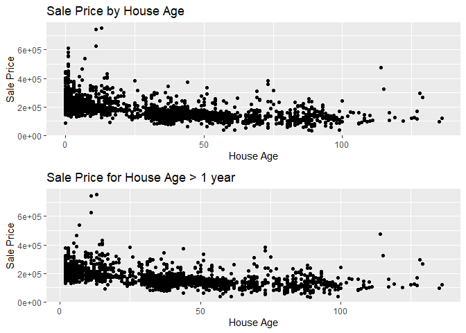<!-- -->

The first plot takes all the houses into account whereas the second only take houses aged 2 years or more. The linear relationship is more visible in the second plot and we can see that new houses (1 year or less) follow a different pattern.

That means that in addition to *HouseAge*, it might be relevant to add a *NewHouse* variable that is 1 if the house is new and 0 if not :


```r
train[, NewHouse := ifelse(HouseAge <= 1, 1, 0)]
train[, NewHouse := factor(NewHouse)]
```

Let's see if we notice a significant difference between these two categories :


```r
ggplot(data = train, aes(x = NewHouse, y = SalePrice, fill = NewHouse)) + 
   geom_boxplot() + theme(legend.position = "none")+
   scale_y_continuous(labels = comma)
```

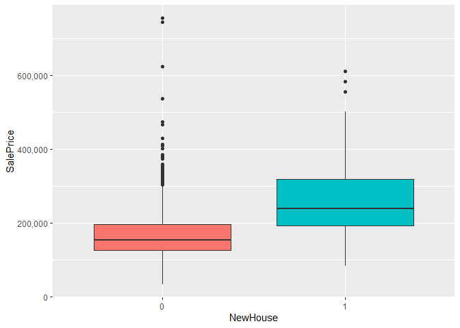<!-- -->

New houses seem to generally have a higher sale price.

## Neighborhood

Neighborhood is one of the most important variable. However, it is not only categorical, but also has a lot of levels. To make it easier for our model to take neighborhood into account, we want to split it into categories such as poor, medium and expensive. 

Let's see if there is a clear separation that can be used to classify them. To do that, we will plot the mean sale price for every neighborhood :


```r
neig_sp_mean <- train %>% group_by(Neighborhood) %>% summarise(mn = mean(SalePrice))

spmean <- mean(train$SalePrice)

ggplot(data = neig_sp_mean, aes(x = reorder(Neighborhood, mn), y = mn, fill = mn)) + 
   geom_bar(stat = "identity")+
   labs(x = "Neighborhood", y = "Mean Sale Price")+
   scale_y_continuous(breaks= seq(0, 800000, by=50000))+
   ggtitle("Mean Sale Price by Neighborhood")+
   theme(axis.text.x = element_text(angle = 45, vjust = 1, hjust = 1),
         legend.position = "none")+
   geom_hline(yintercept = spmean, color = "red")+


   geom_text(aes(0, spmean, label = "Dataset mean sale price", vjust = -1, hjust = -0.1))
```

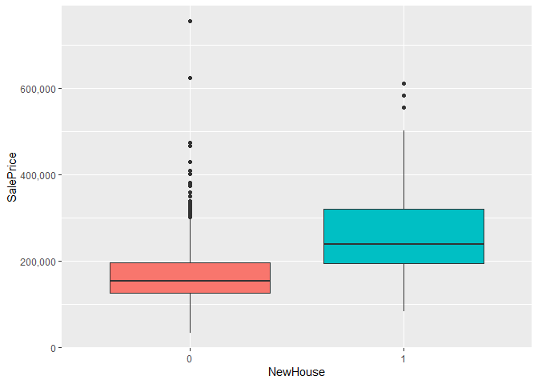<!-- -->

We can actually see 4 categories :

- 3 neighborhoods appear to have mean sale prices far above the others
- Similarly, 3 neighborhood seem to have lower mean sale prices
- As for the other neighborhood, there seem to be a separation between Mitchel and SawyerW, around the dataset mean sale price.

Therefore, we will apply the following classification for neighborhoods :


```r
ggplot(data = neig_sp_mean, aes(x = reorder(Neighborhood, mn), y = mn, fill = mn)) + 
   geom_bar(stat = "identity")+
   labs(x = "Neighborhood", y = "Mean Sale Price")+
   scale_y_continuous(breaks= seq(0, 800000, by=50000))+
   ggtitle("Neighborhood Categories")+
   theme(axis.text.x = element_text(angle = 45, vjust = 1, hjust = 1),
         legend.position = "none")+
   geom_hline(yintercept = spmean, color = "red")+
   geom_vline(xintercept = 3.5, color = "green", size = 1.2)+
   geom_vline(xintercept = 12.5, color = "green", size = 1.2)+
   geom_vline(xintercept = 22.5, color = "green", size = 1.2)+

   geom_text(aes(1.25, 320000, label = "Poor", vjust = -1, hjust = -0.1))+
   geom_text(aes(6.5, 320000, label = "Med-low", vjust = -1, hjust = -0.1))+   
   geom_text(aes(16, 320000, label = "Med-high", vjust = -1, hjust = -0.1))+   
   geom_text(aes(23.25, 320000, label = "Rich", vjust = -1, hjust = -0.1))
```

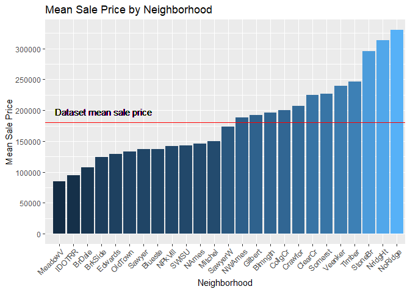<!-- -->


```r
neig_classify <- function(x){
   if (x %in% c("MeadowV", "IDOTRR", "BrDale")){
      return(0)
   }else if (x %in% c("BrkSide", "Edwards", "OldTown", "Sawyer", "Blueste", 
                      "NPkVill", "SWISU", "NAmes", "Mitchel")){
      return(1)
   }else if (x %in% c("SawyerW", "NWAmes", "Gilbert", "Blmngtn", "CollgCr",
                      "Crawfor", "ClearCr", "Somerst", "Veenker", "Timber")){
      return(2)
   }else if (x %in% c("StoneBr", "NridgHt", "NoRidge")){
      return(3)
   }else{
      return(NA)
   }
}

train[, NeighClass := neig_classify(Neighborhood), by = seq_len(nrow(train))]
train[, NeighClass := factor(NeighClass)]
train <- select(train, -Neighborhood)
```

## Utilities

In our dataset, one variable has a peculiar characteristic of having almost only one value : *Utilities*


```r
table(train$Utilities)
```

```
## 
## AllPub NoSeWa 
##   1450      1
```

This variable has almost zero variation and will bring nothing to the model building, so we'll remove it


```r
train <- select(train, -Utilities)
```

# Pre-processing

We're almost ready to build our model, but before we do so we need to preprocess our data by :

- Removing reduncancies (highly correlated variables)
- Removing outliers
- Updating factor levels
- Normalize numeric variables
- Encoding categorical variables
- Normalize response variable

## Back to correlations

Our dataset has now changed quite a bit : most redundancies have been removed by combining variables into one. Here, we'll have another quick look at correlations to see if there are some highly correlated variables left :


```r
integer_cols2 <- sapply(train, function(y){(class(y) == "integer") | (class(y) == "numeric")})
integer_train2 <- train[, .SD, .SDcols = integer_cols2]


# Correlation matrix :
train_cor2 <- cor(integer_train2, use = "complete")


# Isolate SalePrice column and sort variables from highest cor with SalePrice
# to lowest cor
train_cor_sort2 <- row.names(as.matrix(sort(train_cor2[,'SalePrice'], decreasing = TRUE)))

# Keep cors > 0.5
#high_cors2 <- names(which(apply(train_cor_sort2, 1, function(x) abs(x)>0)))
train_cor2 <- train_cor2[train_cor_sort2, train_cor_sort2]

# Corrplot2 is a modified version of corrplot that prevents labels to go out of
# the image's frame. If you're interested, it will be on my .Rmd file
corrplot2(train_cor2, method = "square", type = "lower", 
         title = "Correlation plot between numeric variables",
         tl.col = "black", tl.cex = 0.6, 
         mar = c(0,0,2,0))
```

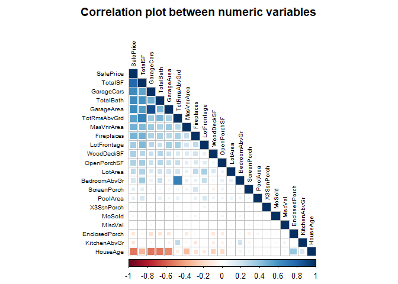<!-- -->

These variables seem to be highly correlated :

- *GarageArea* and *GarageCars*
- *TotRmsAbvGrd* and *TotalSF*
- *TotRmsAbvGrd* and *BedroomAbvGr*


```r
with(train, cor(GarageArea, GarageCars))
```

```
## [1] 0.8824697
```

```r
with(train, cor(TotRmsAbvGrd, TotalSF))
```

```
## [1] 0.6798009
```

```r
with(train, cor(TotRmsAbvGrd, BedroomAbvGr))
```

```
## [1] 0.6755895
```

We'll keep *GarageCars*, *TotalSF* that have a higher correlation with *SalePrice* and remove *GarageArea* and *TotRmsAbvGrd*

In addition, the *MoSold* variable has no correlation with *SalePrice* nor with any variable. This confirms an intuitive assumption that, globally, the month of the sale has little impact on the sale price. We will also remove this variable


```r
train <- select(train, -c("GarageArea", "TotRmsAbvGrd", 'MoSold'))
```

## Outliers

We saw during the exploratory data analysis that our 364th overvation was an outlier. To improve our model's accuracy, we will remove it from the training set


```r
train <- train[-c(524, 1299), ]
```

## Levels

In our study, we only did exploratory data analysis without any interaction on our testing set.

By doing so, we created a minor issue that needs fixing : factor levels discrepancies between the datasets. Some factor variables have levels that almost never appear, so one level might never appear in the training set but will appear in our testing set. That will confuse our model during prediction.

Even if a level never appears in the training set, our model needs to know that it still exists. To do that, the following code will :

- re-open the original training set
- concatenate it to the testing set
- Pre-process it the same way we did so far to the train set
- extract all levels for every factor variable
- apply it to our training set variables


```r
train_original <- read.csv(trainfile)
train_original <- data.table(rbind(train_original, mutate(test, SalePrice = NA)))

# Factorize variables :
for (j in names(temp_na2)){
   set(train_original,which(is.na(train_original[[j]])),j,"None")
}
train_original[, (to_factor) := lapply(.SD, as.factor), .SDcols = to_factor]

# Feature engineering + Removing variables 
train_original <- select(train_original, -c("Id", "GarageYrBlt", "Utilities"))
train_original[, TotalSF := GrLivArea + TotalBsmtSF]
train_original <- select(train_original, -c("X1stFlrSF", "X2ndFlrSF", "LowQualFinSF", "GrLivArea", 
                "BsmtFinSF1", "BsmtFinSF2", "BsmtUnfSF", "TotalBsmtSF"))
train_original[, TotalBath := FullBath + (0.5 * HalfBath) + BsmtFullBath + (0.5 * BsmtHalfBath)]
train_original <- select(train_original, -c("FullBath", "HalfBath", "BsmtFullBath",  "BsmtHalfBath"))
train_original[, HouseAge := YrSold - YearBuilt]
train_original[, RemodAdd := ifelse(YearBuilt == YearRemodAdd, 0, 1)]
train_original[, RemodAdd := factor(RemodAdd)]
train_original <- select(train_original, -c("YearBuilt", "YrSold", "YearRemodAdd"))
train_original[, NewHouse := ifelse(HouseAge <= 1, 1, 0)]
train_original[, NewHouse := factor(NewHouse)]
train_original[, NeighClass := neig_classify(Neighborhood), by = seq_len(nrow(train_original))]
train_original[, NeighClass := factor(NeighClass)]
train_original <- select(train_original, -Neighborhood)
train_original <- select(train_original, -c("GarageArea", "TotRmsAbvGrd", "MoSold"))

# Extracting levels
level_list <- list()
for (j in names(train_original)){
   if (class(train_original[[j]]) == "factor"){
      level_list <- c(level_list, list(levels(train_original[[j]])))
   }else{
      level_list <- c(level_list, list(NULL))
   }
}

# Apply to training set :

for (j in 1:dim(train)[2]){
   if (class(train[[names(train)[j]]]) == "factor"){
      levels(train[[names(train)[j]]]) <- level_list[[j]]
   }
}
```

## Splitting the frame into numeric and categorical sub-frames

We will pre-process numeric variables and categorical variables differently so we need to split the dataset into two :


```r
numcols <- sapply(train, function(y){(class(y) == "integer") | (class(y) == "numeric")})
num_train <- train[, .SD, .SDcols = numcols]
num_train <- select(num_train, -SalePrice)

cat_train <- train[, .SD, .SDcols = -numcols]
```

We have 17 numeric variables and 48 categorical variables :


```r
ncol(num_train)
```

```
## [1] 17
```

```r
ncol(cat_train)
```

```
## [1] 47
```

## Normalizing numerical variables


```r
PreObj <- preProcess(num_train, method = c("center", "scale"))
normnum_train <- predict(PreObj, num_train)
normnum_train <- data.table(normnum_train)
```


## Encoding categorical variables

To use machine learning models to their top efficiency, all of the predictors need to be numeric, which means that categorical variables need to be encoded in either dummy variables if they only have 2 levels or one-hot encoded if they have more.

In our dataset, the majority of factor variables have more than 2 levels, which means that we will rather use one-hot encoding :


```r
ohe <- dummyVars(~ ., data = cat_train)
ohecat_train <- predict(ohe, cat_train)
ohecat_train <- data.table(ohecat_train)
```

### Low variation dummy variables

One-hot encoding added a lot of variables in our dataset and there could be some that could have near zero occurences. Not only would these bring low predictive value to our model, it could even make it overfit our training set and lower its performance. 

What we'll do here is that we will remove dummy variables that appear less than 15 times (1% of the observations).


```r
low_occurence <- names(which(ohecat_train[, lapply(.SD, sum) < 15]))
ohecat_train <- select(ohecat_train, -low_occurence)
```


## Skewness of response variable

We saw at the beginning of our study that the response variable was skewed. Let's measure it :


```r
skew(train$SalePrice)
```

```
## [1] 1.884394
```

A perfectly symmetrical distribution would have a skewness of 0, and as long as the skewness is between -1 and 1, a distribution can be considered roughly normal. Here, our response variable is way above that, and it can also be seen in a Q-Q plot :


```r
ggplot(data = train, aes(sample = (SalePrice - mean(SalePrice)) / sd(SalePrice))) +
   stat_qq(shape = 1) + geom_abline(intercept = 0, slope = 1, color = "blue") +
   labs(x = "Theoretical Quantiles", y = "Sample Quantiles")+
   ggtitle("Normal Q-Q Plot")
```

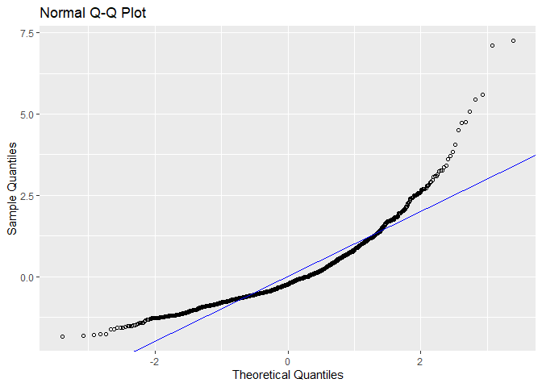<!-- -->

Before applying any transformation, let's simply try using the log instead and see how that solves the skewness;


```r
skew(log(train$SalePrice))
```

```
## [1] 0.1233643
```

The skewness is much better, let's see how it show on the Q-Q plot :


```r
ggplot(data = train, aes(sample = (log(SalePrice) - mean(log(SalePrice))) / sd(log(SalePrice)))) +
   stat_qq(shape = 1) + geom_abline(intercept = 0, slope = 1, color = "blue") +
   labs(x = "Theoretical Quantiles", y = "Sample Quantiles")+
   ggtitle("Normal Q-Q Plot")
```

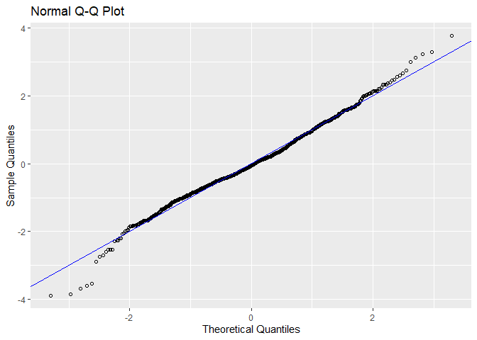<!-- -->

## Final training set 

We combine all our transformed data into one to create our final training set :


```r
model_train <- data.table(cbind(normnum_train, ohecat_train))
model_train$logSalePrice <- log(train$SalePrice)
```

# Model Building

## Ridge, Lasso, Elastinet

Glmnet models are quite robust to outliers and deal well with data that is numeric and categorical so we'll train one with generic hyperparameters that do not penalize to much compared to simple RMSE minimization :


We'll use the **cv.glmnet** function to select the best penalty factor $\lambda$ using cross-validation :


```r
set.seed(013969420)
try_ridge <- cv.glmnet(as.matrix(select(model_train, -logSalePrice)), 
                       model_train$logSalePrice, alpha = 0)
try_lasso <- cv.glmnet(as.matrix(select(model_train, -logSalePrice)), 
                       model_train$logSalePrice, alpha = 1)
try_elnet <- cv.glmnet(as.matrix(select(model_train, -logSalePrice)), 
                       model_train$logSalePrice, alpha = 0.001)

lambda_ridge <- try_ridge$lambda.min
lambda_lasso <- try_lasso$lambda.min
lambda_elnet <- try_elnet$lambda.min
```


Let's train our model using the selected $\lambda$ :


```r
modfit_ridge <- glmnet(as.matrix(select(model_train, -logSalePrice)), 
                       model_train$logSalePrice, alpha = 0, lambda = lambda_ridge)
modfit_lasso <- glmnet(as.matrix(select(model_train, -logSalePrice)), 
                       model_train$logSalePrice, alpha = 1, lambda = lambda_lasso)
modfit_elnet <- glmnet(as.matrix(select(model_train, -logSalePrice)), 
                       model_train$logSalePrice, alpha = 0.001, lambda = lambda_elnet)
```


Let's see what are our models' accuracies :


```r
RMSE(train$SalePrice, 
     exp(predict(modfit_ridge, as.matrix(select(model_train, -logSalePrice))))
     ) / mean(train$SalePrice)
```

```
## [1] 0.1527898
```

```r
RMSE(train$SalePrice, 
     exp(predict(modfit_lasso, as.matrix(select(model_train, -logSalePrice))))
     ) / mean(train$SalePrice)
```

```
## [1] 0.1446308
```

```r
RMSE(train$SalePrice, 
     exp(predict(modfit_elnet, as.matrix(select(model_train, -logSalePrice))))
     ) / mean(train$SalePrice)
```

```
## [1] 0.1560154
```

The accuracies seem pretty good and equivalent for all 3 models.

## SVM

A key feature of our data is it is relatively small, and we reduced the number of variables quite a bit during our feature engineering. In addition, all of the categorical variables have been encoded. 

We therefore have an excellent context to build an SVM model.

The process is extremely long so we'll do some parallel processing :


```r
library(parallel)
library(doParallel)
cluster1 <- makeCluster(detectCores() - 1)
registerDoParallel(cluster1)

set.seed(12345)
tuned = tune.svm(logSalePrice ~ ., data = model_train, 
                 gamma = c(0.01, 0.1, 1, 10),
                 cost = c(seq(0.1, 1, by = 0.1), seq(1, 10, by = 1), seq(10,100, by=10)),
                 coef0 = c(0.1, 1, 10),
                 tunecontrol=tune.control(cross=10))
stopCluster(cluster1)
registerDoSEQ()
```


Let's see what are the best model's parameters :

```r
tuned$best.parameters
```

```
##     gamma coef0 cost
## 169  0.01   0.1    5
```

```r
tuned$best.model
```

```
## 
## Call:
## best.svm(x = logSalePrice ~ ., data = model_train, gamma = c(0.01, 
##     0.1, 1, 10), coef0 = c(0.1, 1, 10), cost = c(seq(0.1, 1, by = 0.1), 
##     seq(1, 10, by = 1), seq(10, 100, by = 10)), tunecontrol = tune.control(cross = 10))
## 
## 
## Parameters:
##    SVM-Type:  eps-regression 
##  SVM-Kernel:  radial 
##        cost:  5 
##       gamma:  0.01 
##     epsilon:  0.1 
## 
## 
## Number of Support Vectors:  1037
```


```r
modfit_svm <- tuned$best.model
```


Let's check the accuracy of our model :


```r
RMSE(train$SalePrice, 
     exp(predict(modfit_svm, select(model_train, -logSalePrice)))
     ) / mean(train$SalePrice)
```

```
## [1] 0.0398023
```

The accuracy is even better than the lasso, ridge and elastinet models.

## XGB

Here, our first goal is to define the proper hyperparameters to use, so we use the following grid to train a model fit with caret, which will then tell us what the best tune is. We will also call the parallel and doParallel packages to use parallel processing :


```r
library(parallel)
library(doParallel)
cluster1 <- makeCluster(detectCores() - 1)
registerDoParallel(cluster1)

trctrl <- trainControl(method = "cv", number = 5, allowParallel = T, 
                       verboseIter = F)

xgbGrid <- expand.grid(nrounds = 750,  
                       max_depth = seq(1, 10, by = 1),
                       colsample_bytree = seq(0.5, 0.9, length.out = 5),
                       eta = seq(0.01, 0.1, length.out = 4),
                       gamma=0,
                       min_child_weight = seq(1, 5, by = 1),
                       subsample = 1
                      )
set.seed(69420)
modfit_xgbm2 <- caret::train(logSalePrice ~ ., data = model_train,
                            method = "xgbTree", 
                            trControl = trctrl,
                            tuneGrid = xgbGrid)
stopCluster(cluster1)
registerDoSEQ()
```


Let's see what the best tune for the XGB model is :


```r
modfit_xgbm2$bestTune
```

```
##     nrounds max_depth  eta gamma colsample_bytree min_child_weight subsample
## 602     750         5 0.07     0              0.5                2         1
```

We set these as default hyperparameters :


```r
xgbparam <- list(objective = "reg:linear",
                 booster = "gbtree",
                 max_depth = 5,
                 colsample_bytree = 0.5,
                 eta = 0.07,
                 gamma=0,
                 min_child_weight = 2,
                 subsample = 1
                )
```

Now we'll do another series of cross-validations, this time to figure out the best number of rounds :


```r
set.seed(1234)
xgb_cv <- xgb.cv(params = xgbparam, data = as.matrix(model_train), 
                 nrounds = 10000, nfold = 5, showsd = T, stratified = T, 
                 print_every_n = 50, early_stopping_rounds = 15, maximize = F, 
                 label = model_train$logSalePrice)
```

```
## [19:02:06] WARNING: amalgamation/../src/objective/regression_obj.cu:170: reg:linear is now deprecated in favor of reg:squarederror.
## [19:02:06] WARNING: amalgamation/../src/objective/regression_obj.cu:170: reg:linear is now deprecated in favor of reg:squarederror.
## [19:02:06] WARNING: amalgamation/../src/objective/regression_obj.cu:170: reg:linear is now deprecated in favor of reg:squarederror.
## [19:02:06] WARNING: amalgamation/../src/objective/regression_obj.cu:170: reg:linear is now deprecated in favor of reg:squarederror.
## [19:02:06] WARNING: amalgamation/../src/objective/regression_obj.cu:170: reg:linear is now deprecated in favor of reg:squarederror.
## [1]	train-rmse:10.723375+0.005491	test-rmse:10.722725+0.024506 
## Multiple eval metrics are present. Will use test_rmse for early stopping.
## Will train until test_rmse hasn't improved in 15 rounds.
## 
## [51]	train-rmse:0.296705+0.001122	test-rmse:0.297821+0.006828 
## [101]	train-rmse:0.025824+0.002595	test-rmse:0.042668+0.002876 
## [151]	train-rmse:0.012986+0.001293	test-rmse:0.035003+0.002481 
## [201]	train-rmse:0.008597+0.000780	test-rmse:0.032967+0.002404 
## [251]	train-rmse:0.006306+0.000635	test-rmse:0.032156+0.002423 
## [301]	train-rmse:0.004792+0.000441	test-rmse:0.031638+0.002391 
## [351]	train-rmse:0.003785+0.000300	test-rmse:0.031294+0.002346 
## [401]	train-rmse:0.003113+0.000242	test-rmse:0.031119+0.002365 
## [451]	train-rmse:0.002558+0.000204	test-rmse:0.030999+0.002379 
## [501]	train-rmse:0.002131+0.000168	test-rmse:0.030891+0.002358 
## [551]	train-rmse:0.001796+0.000157	test-rmse:0.030822+0.002365 
## [601]	train-rmse:0.001530+0.000131	test-rmse:0.030768+0.002367 
## [651]	train-rmse:0.001307+0.000112	test-rmse:0.030733+0.002363 
## [701]	train-rmse:0.001180+0.000045	test-rmse:0.030711+0.002359 
## Stopping. Best iteration:
## [722]	train-rmse:0.001164+0.000042	test-rmse:0.030706+0.002361
```

we now know all the parameters for a perfect xgb model fit :


```r
dmat_train <- xgb.DMatrix(data = as.matrix(select(model_train, -logSalePrice)), label = model_train$logSalePrice)
```


```r
modfit_xgbm <- xgb.train(dmat_train, params = xgbparam, nrounds = 722)
```


We can now check the accuracy of our model :


```r
RMSE(train$SalePrice, 
     exp(predict(modfit_xgbm, dmat_train))
     ) / mean(train$SalePrice)
```

```
## [19:02:20] WARNING: amalgamation/../src/objective/regression_obj.cu:170: reg:linear is now deprecated in favor of reg:squarederror.
```

```
## [1] 0.01731364
```
The accuracy is extremely good, and way above the other models.

Moreover, XGBoost models also provides us with feature importance. Let's see if there was any changes :


```r
imp_mat <- xgb.importance(feature_names = colnames(model_train), model = modfit_xgbm)
```

```
## [19:02:20] WARNING: amalgamation/../src/objective/regression_obj.cu:170: reg:linear is now deprecated in favor of reg:squarederror.
```

```r
xgb.ggplot.importance(importance_matrix = imp_mat[1:20], rel_to_first = T)
```

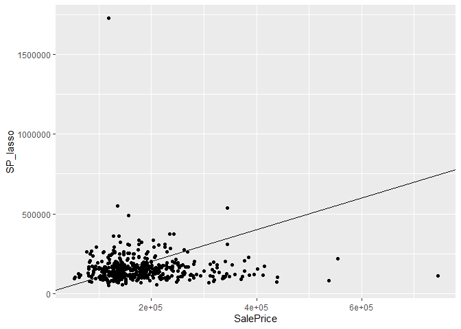<!-- -->

Numeric variables having more importance seems logical since categorical variables have been split into multiple dummy variables. Even so, we can see that some categorical variables keep having significant weight in our model.


# Using the test dataset for the final submission

## Initial Pre-processing the test set


```r
# Saving ID column, necessary for submission
test_ID <- test$Id

# Factorize variables :
for (j in names(temp_na2)){
   set(test,which(is.na(test[[j]])),j,"None")
}
test[, (to_factor) := lapply(.SD, as.factor), .SDcols = to_factor]
```


## Checking NAs


```r
temp_na3 <- as.numeric(test[, lapply(.SD, function(y){sum(is.na(y))})])
names(temp_na3) <- names(test)
temp_na3 <- temp_na3[temp_na3 > 0]
print(temp_na3)
```

```
##     MSZoning  LotFrontage    Utilities  Exterior1st  Exterior2nd   MasVnrType 
##            4          227            2            1            1           16 
##   MasVnrArea   BsmtFinSF1   BsmtFinSF2    BsmtUnfSF  TotalBsmtSF BsmtFullBath 
##           15            1            1            1            1            2 
## BsmtHalfBath  KitchenQual   Functional  GarageYrBlt   GarageCars   GarageArea 
##            2            1            2           78            1            1 
##     SaleType 
##            1
```

The test set has a lot of NAs. Doing exploratory analysis on a testing set is never recommended so we'll have to either correct these missing values using known features of our training set, or by calling values from the test set without exploring them.

Removing NAs will greatly improve our models' accuracies, and is mandatory for the SVM model that will return an error if any NAs are present.

### LotFrontage

We'll do the same as with the train set :


```r
# Removing LotFrontage NAs based on the train dataset means :
for (i in 1:nrow(test)){
   if (is.na(test$LotFrontage[i])){
      ngbr <- test$Neighborhood[i]
      lf_mean <- neig_lf_mean[.(ngbr)]$meanLF # calling the mean with the key
      test$LotFrontage[i] <- lf_mean
   }
}
```

### MSZoning

We have 4 missing values which we will replace by the most probable value :


```r
test[is.na(MSZoning),]$MSZoning <- names(sort(-table(test$MSZoning)))[1]
```

### Exterior variables

A house has to have an exterior coverage so "None" is not a possible value. Therefore, when an *Exterior1st* or *Exterior2nd* value is missing, we'll input the most probable one :


```r
test[is.na(Exterior1st), ]$Exterior1st <- names(sort(-table(test$Exterior1st)))[1]
test[is.na(Exterior2nd), ]$Exterior2nd <- names(sort(-table(test$Exterior2nd)))[1]
```

### MasVnrType & MasVnrArea 

We have 16 NAs for MasVnrType and 15 for MasVnrArea, which means that one MasVnrType has a typo, because you can't have a masonry area without a masonry type. 


```r
test[is.na(test$MasVnrType) & !is.na(test$MasVnrArea), c("Id", 'MasVnrType', 'MasVnrArea')]
```

```
##      Id MasVnrType MasVnrArea
## 1: 2611       <NA>        198
```

It's the house n°2611 that has this issue. We'll imput the most frequent type of masonry type (actually the second most frequent because the first is "None") :


```r
test[test$Id == 2611,]$MasVnrType <-  names(sort(-table(test$MasVnrType)))[2]
```

As for the other areas, we'll set them to 0 is the type is NA and we'll set the types to "none"


```r
test[is.na(MasVnrType),]$MasVnrArea <- 0
test[is.na(MasVnrType),]$MasVnrType <- "None"
```

### Basement Variables


```r
test[is.na(BsmtFinSF1), .SD, 
     .SDcols = c("Id", "BsmtFinType1", "BsmtFinSF1","BsmtFinType2", "BsmtFinSF2", "BsmtUnfSF", "TotalBsmtSF", 
                 "BsmtFullBath", "BsmtHalfBath")]
```

```
##      Id BsmtFinType1 BsmtFinSF1 BsmtFinType2 BsmtFinSF2 BsmtUnfSF TotalBsmtSF
## 1: 2121         None         NA         None         NA        NA          NA
##    BsmtFullBath BsmtHalfBath
## 1:           NA           NA
```
One row contains most of our remaining NAs for basement variables, simply because there is no basement. We'll set these values to 0


```r
test[test$Id == 2121,]$BsmtFinSF1 <- 0
test[test$Id == 2121,]$BsmtFinSF2 <- 0
test[test$Id == 2121,]$BsmtUnfSF <- 0
test[test$Id == 2121,]$TotalBsmtSF <- 0
test[test$Id == 2121,]$BsmtFullBath <- 0
test[test$Id == 2121,]$BsmtHalfBath <- 0
```

### Bathroom variables


```r
test[is.na(BsmtFullBath), .SD, .SDcols = c("Id", "BsmtFinType1", "BsmtFinType2", "BsmtFullBath", "BsmtHalfBath")]
```

```
##      Id BsmtFinType1 BsmtFinType2 BsmtFullBath BsmtHalfBath
## 1: 2189         None         None           NA           NA
```
These bathroom surfaces should logically be set to 0 :


```r
test[test$Id == 2189, ]$BsmtFullBath <- 0
test[test$Id == 2189, ]$BsmtHalfBath <- 0
```

### Kitchen variables

There is only 1 missing value, which we'll replace by the most common value :


```r
test[is.na(KitchenQual)]$KitchenQual <- names(sort(-table(test$KitchenQual)))[1]
```

### Home functionality variable

There is only 2 missing values, which we'll replace by the most common value :


```r
test[is.na(Functional)]$Functional <- names(sort(-table(test$Functional)))[1]
```

### GarageCars and GarageArea


```r
test[is.na(GarageCars), .SD, 
     .SDcols = c("Id", "GarageCars", "GarageArea", "GarageType")]
```

```
##      Id GarageCars GarageArea GarageType
## 1: 2577         NA         NA     Detchd
```

We'll assume that there is a typo and this house has no garage :


```r
test[test$Id == 2577, ]$GarageCars <- 0
test[test$Id == 2577, ]$GarageArea <- 0
test[test$Id == 2577, ]$GarageType <- "None"
```

### SaleType variable

There is only 1 missing value, which we'll replace by the most common value :


```r
test[is.na(SaleType)]$SaleType <- names(sort(-table(test$SaleType)))[1]
```


## Final pre-processing of the test set

There are some remaining NAs but they are on columns that will be removed during pre-processing :

```r
# Feature engineering + Removing variables 
test <- select(test, -c("Id", "GarageYrBlt", "Utilities"))
test[, TotalSF := GrLivArea + TotalBsmtSF]
test <- select(test, -c("X1stFlrSF", "X2ndFlrSF", "LowQualFinSF", "GrLivArea", 
                "BsmtFinSF1", "BsmtFinSF2", "BsmtUnfSF", "TotalBsmtSF"))
test[, TotalBath := FullBath + (0.5 * HalfBath) + BsmtFullBath + (0.5 * BsmtHalfBath)]
test <- select(test, -c("FullBath", "HalfBath", "BsmtFullBath",  "BsmtHalfBath"))
test[, HouseAge := YrSold - YearBuilt]
test[, RemodAdd := ifelse(YearBuilt == YearRemodAdd, 0, 1)]
test[, RemodAdd := factor(RemodAdd)]
test <- select(test, -c("YearBuilt", "YrSold", "YearRemodAdd"))
test[, NewHouse := ifelse(HouseAge <= 1, 1, 0)]
test[, NewHouse := factor(NewHouse)]
test[, NeighClass := neig_classify(Neighborhood), by = seq_len(nrow(test))]
test[, NeighClass := factor(NeighClass)]
test <- select(test, -Neighborhood)
test <- select(test, -c("GarageArea", "TotRmsAbvGrd", "MoSold"))


# splitting into numeric and categorical variables
numcols <- sapply(test, function(y){(class(y) == "integer") | (class(y) == "numeric")})
num_test <- test[, .SD, .SDcols = numcols]


cat_test <- test[, .SD, .SDcols = -numcols]

# normalizing num vars
normnum_test <- predict(PreObj, num_test)
normnum_test <- data.table(normnum_test)

# encoding categorical vars
#ohetest <- dummyVars(~ ., data = cat_test)
ohecat_test <- predict(ohe, cat_test)
ohecat_test <- data.table(ohecat_test)
ohecat_test <- select(ohecat_test, -low_occurence)

# binding into a preprocessed sub-test dataset
preproc_test <- data.table(cbind(normnum_test, ohecat_test))


# for XGB predictions we convert preproc_test into a DMatrix
dmat_pptest <- xgb.DMatrix(data = as.matrix(preproc_test))
```

## Creating the answer frame

We'll combine the models into an ensemble one. The lasso model being the weakest one, its coefficient will be 1, then the SVM model's coefficient will be 2 and finally the XGBM model's will be 4 :


```r
loganswer_ridge <- predict(modfit_ridge, as.matrix(preproc_test))
answer_ridge <- exp(loganswer_ridge)

loganswer_lasso <- predict(modfit_lasso, as.matrix(preproc_test))
answer_lasso <- exp(loganswer_lasso)

loganswer_elnet <- predict(modfit_elnet, as.matrix(preproc_test))
answer_elnet <- exp(loganswer_elnet)

answer_RLE <- (answer_ridge + answer_lasso + answer_elnet) / 3

loganswer_svm <- predict(modfit_svm, preproc_test)
answer_svm <- exp(loganswer_svm)

loganswer_xgbm <- predict(modfit_xgbm, dmat_pptest)
```

```
## [19:02:22] WARNING: amalgamation/../src/objective/regression_obj.cu:170: reg:linear is now deprecated in favor of reg:squarederror.
```

```r
answer_xgbm <- exp(loganswer_xgbm)

answer <- (answer_RLE +  answer_svm + answer_xgbm) / 3
answer_bis <- (answer_RLE + answer_xgbm) / 2
answer_ter <- (answer_ridge + answer_elnet + answer_xgbm) / 3

solution_1 <- data.frame(Id = test_ID, SalePrice = answer_RLE)
colnames(solution_1) <- c("Id", "SalePrice")

solution_1_a <- data.frame(Id = test_ID, SalePrice = answer_ridge)
solution_1_b <- data.frame(Id = test_ID, SalePrice = answer_lasso)
solution_1_c <- data.frame(Id = test_ID, SalePrice = answer_elnet)
colnames(solution_1_a) <- c("Id", "SalePrice")
colnames(solution_1_b) <- c("Id", "SalePrice")
colnames(solution_1_c) <- c("Id", "SalePrice")

solution_2 <- data.frame(Id = test_ID, SalePrice = answer_svm)
solution_3 <- data.frame(Id = test_ID, SalePrice = answer_xgbm)
solution_4 <- data.frame(Id = test_ID, SalePrice = answer)
colnames(solution_4) <- c("Id", "SalePrice")
solution_5 <- data.frame(Id = test_ID, SalePrice = answer_bis)
colnames(solution_5) <- c("Id", "SalePrice")
solution_6 <- data.frame(Id = test_ID, SalePrice = answer_ter)
colnames(solution_6) <- c("Id", "SalePrice")
```

## Writing the csv file


```r
write.csv(solution_1, "house_price_solution_5.csv", row.names = F)
write.csv(solution_2, "house_price_solution_6.csv", row.names = F)
write.csv(solution_3, "house_price_solution_7.csv", row.names = F)
write.csv(solution_4, "house_price_solution_8.csv", row.names = F)
write.csv(solution_5, "house_price_solution_9.csv", row.names = F)
write.csv(solution_6, "house_price_solution_10.csv", row.names = F)

write.csv(solution_1_a, "house_price_solution_5a.csv", row.names = F)
write.csv(solution_1_b, "house_price_solution_5b.csv", row.names = F)
write.csv(solution_1_c, "house_price_solution_5c.csv", row.names = F)
```

# Score

We obtained the following score for our models :

- Ridge : 0.14391
- Lasso : 0.16004
- Elastinet : 0.14430
- Ridge + Lasso + Elastinet : 0.14575
- SVM : 0.23927
- XGBM : 0.13287
- Ensemble : 0.15334
- Ensemble without SVM : 0.13284


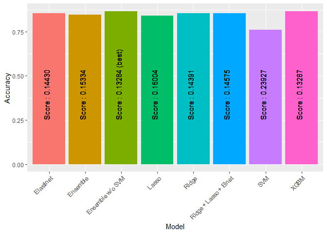<!-- -->

The XGBM model is by far superior to the others and is only slightly improved when combined with Lasso, Ridge and Elastinet.

The SVM model had a very high accuracy on our training set but performs poorly on the testing set. It appears that it is severely overfitting.


